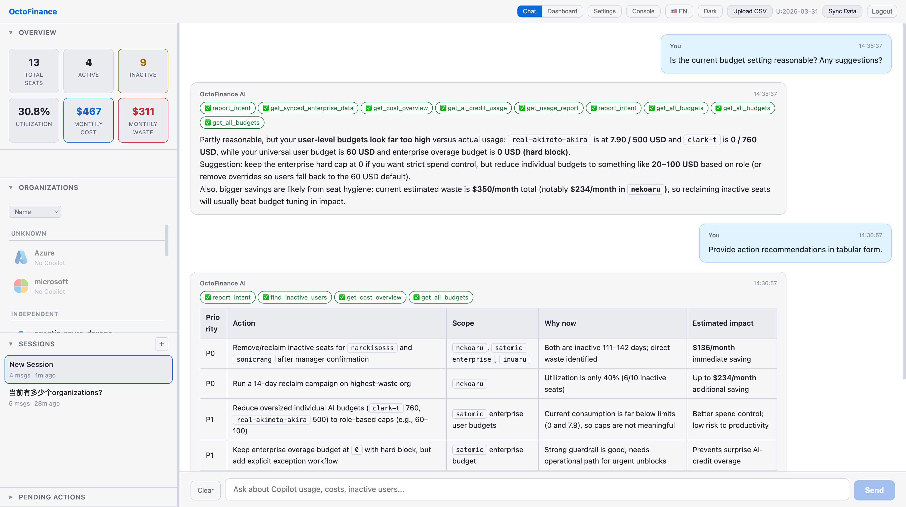
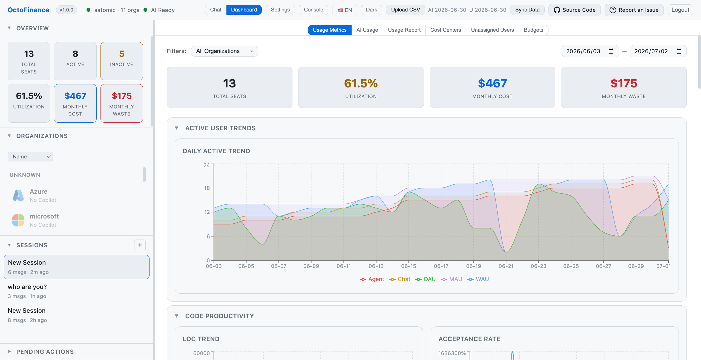
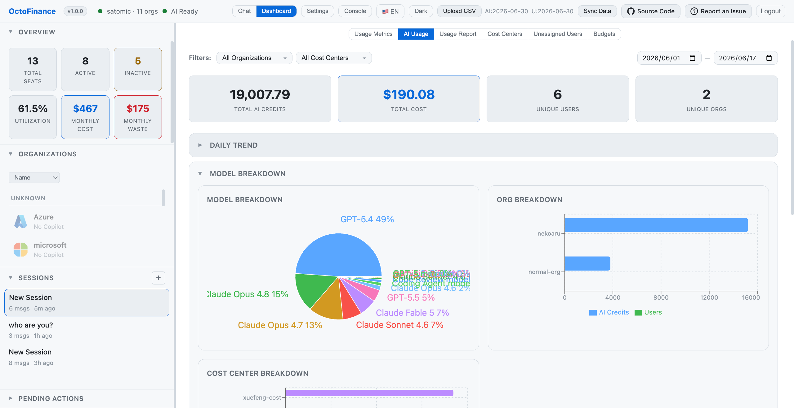
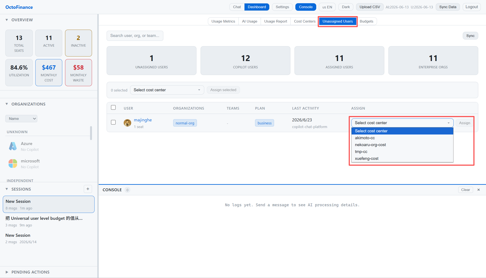
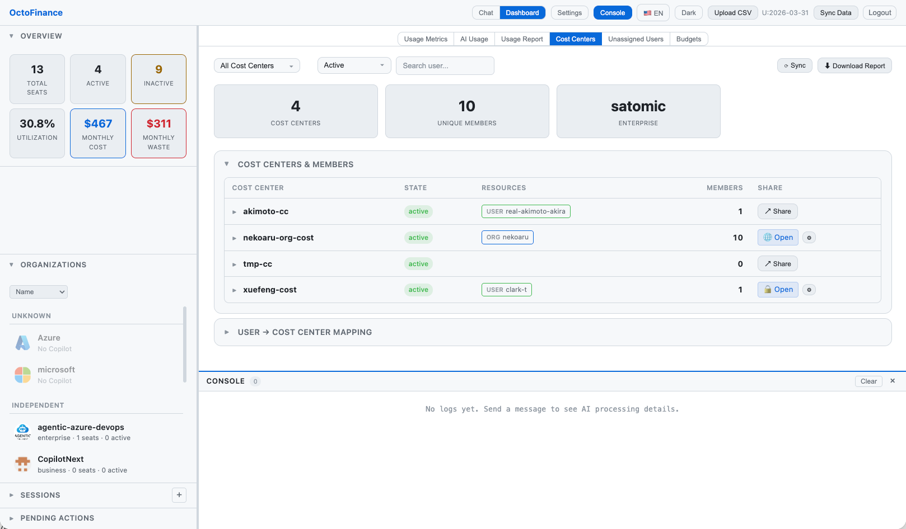

# OctoFinance — AI-Powered GitHub Copilot FinOps Platform


## Project Summary

OctoFinance is an AI-powered GitHub Copilot FinOps platform built on the Copilot SDK that transforms how enterprises manage Copilot seat costs at scale. Instead of manually analyzing usage spreadsheets across multiple organizations, administrators simply ask questions in natural language — "Which users haven't used Copilot in 30 days? How much are we wasting?" — and the AI agent autonomously calls 23 custom tools to analyze real-time data from GitHub APIs, identify waste, calculate ROI, manage UBB budgets, and recommend optimizations. A human-in-the-loop approval workflow ensures destructive operations like seat removal require explicit admin confirmation. The platform features a rich analytics dashboard with 9 visualization sections, multi-org/multi-enterprise support with automatic discovery, real-time data synchronization, per-user AI credit usage tracking, and comprehensive audit logging. Built with Python FastAPI, React, and the GitHub Copilot Python SDK, OctoFinance delivers enterprise-grade FinOps automation that turns Copilot cost management from a manual burden into an intelligent, conversational experience.











---

## Problem & Solution

**Problem**: Enterprises managing hundreds or thousands of Copilot seats across multiple organizations lack unified visibility into usage, waste, and ROI. Manual cost analysis through spreadsheets is time-consuming and error-prone, and AI credit costs are hard to track per-user.

**Solution**: An AI-first FinOps platform built on the GitHub Copilot SDK with:
- **Conversational interface** — Ask questions in natural language, get data-driven answers
- **23 custom tools** — Autonomous data analysis via `define_tool()` API including budget management
- **Human-in-the-loop** — AI recommends, admin approves before destructive operations
- **Multi-dashboard analytics** — Rich usage, AI credits, budgets, and Cost Center views
- **Multi-org management** — Multiple PATs, auto-discovery, cross-org analysis

---

## Architecture

```
┌────────────────────────────────────────────────────────────────────┐
│              React Frontend (Vite + TypeScript)                     │
│   AI Chat (SSE) · Dashboard (9 sections) · Action Panel · Auth     │
└──────────────────────────┬─────────────────────────────────────────┘
                SSE / REST │
┌──────────────────────────┴─────────────────────────────────────────┐
│              FastAPI Backend (Python 3.13+)                         │
│   Copilot SDK AI Engine (23 tools) · Auth · Sync · PAT Manager     │
│   Data Collector · Audit Log · Budget Management                   │
└──────────────────────────┬─────────────────────────────────────────┘
                           │
              GitHub REST API (Seats, Billing, Usage, Metrics, AI Credits, Budgets)
                           │
              JSON Data Store (No database required)
```

See [docs/ARCHITECTURE.md](docs/ARCHITECTURE.md) for the full architecture diagram, data flow, and project structure.

---

## Key Features

- **Copilot SDK Agentic AI** — 23 custom tools including budget management, SSE streaming, session management
- **Budget Management** — UBB (Usage-Based Billing) AI credits budget controls (Universal/Individual user-level, Enterprise, Cost center)
- **Analytics Dashboard** — Usage, AI credits, budgets, and Cost Center dashboards
- **Cost Center Assignment** — List Copilot users not assigned to any Cost Center, then assign one or many users with confirmation
- **Cost Center Report Sharing** — Share a per-cost-center HTML report page via a tokenized public link (`/share/cc/{token}`), no OctoFinance account required. Each share can be **public** or **password-protected** (PBKDF2-hashed), and can be updated (change password / switch mode) or disabled at any time from the Cost Centers dashboard. The shared page uses the same template as the Download Report export, plus a top-right Download button to save the report as a standalone HTML file. Share settings are persisted in `data/cc_shares.json`
  
- **Multi-Org Management** — Multiple PATs, auto-discovery, enterprise support, including enterprises with **no organizations** (Copilot granted purely via Enterprise Teams) via a per-PAT "Include Organizations" toggle — enterprise-level seats/usage/AI-credit data is synced instead, so the dashboard stays fully populated
- **Human-in-the-Loop** — Recommendation → Review → Approve/Reject workflow
- **Real-Time Sync** — Auto-sync, cron scheduling, SSE progress streaming, with **incremental historical merge** so usage data accumulates beyond GitHub's rolling 28-day reporting window instead of being overwritten on every sync
- **AI Credit Tracking** — Org-level API data + per-user CSV upload
- **Security** — Cookie auth, PBKDF2 hashing, audit logging
- **i18n** — English and Chinese (Simplified)
- **Theming** — Dark and Light modes

See [docs/FEATURES.md](docs/FEATURES.md) for detailed feature descriptions and full API reference.

---

## Quick Start

### Prerequisites

| Requirement | Version |
|-------------|---------|
| Python | 3.13+ |
| Node.js | 22+ |
| GitHub Copilot CLI | Latest |
| GitHub PAT | `read:org` + `admin:org` + `copilot` + `manage_billing:copilot` |

### Setup

```bash
# 1. Clone the repository
git clone https://github.com/satomic/OctoFinance.git
cd OctoFinance

# 2. Set up Python environment
python3 -m venv .venv
source .venv/bin/activate  # Windows: .venv\Scripts\activate
pip install -r backend/requirements.txt

# 3. Install & authenticate GitHub Copilot CLI
brew install copilot-cli        # macOS
copilot                         # Follow prompts to authenticate

# 4. Start backend
cd backend
../.venv/bin/uvicorn app.main:app --reload --port 8000

# 5. Start frontend (new terminal)
cd frontend
npm install
npm run dev
```

Visit http://localhost:5173 — On first visit, create your admin credentials.

### Production Deployment

```bash
cd frontend && npm run build && cd ..
cd backend && ../.venv/bin/uvicorn app.main:app --host 0.0.0.0 --port 8000
```

---

## Documentation

| Document | Description |
|----------|-------------|
| [docs/USAGE.md](docs/USAGE.md) | Usage guide — UI walkthrough, chat examples, dashboard |
| [docs/FEATURES.md](docs/FEATURES.md) | Detailed features, tool catalog, API reference |
| [docs/ARCHITECTURE.md](docs/ARCHITECTURE.md) | Architecture diagram, data flow, tech stack, project structure |
| [docs/SECURITY.md](docs/SECURITY.md) | Responsible AI notes, security considerations |
| [AGENTS.md](AGENTS.md) | Custom instructions & agent configuration |

---

*Built with the [GitHub Copilot Python SDK](https://github.com/github/copilot-sdk)*