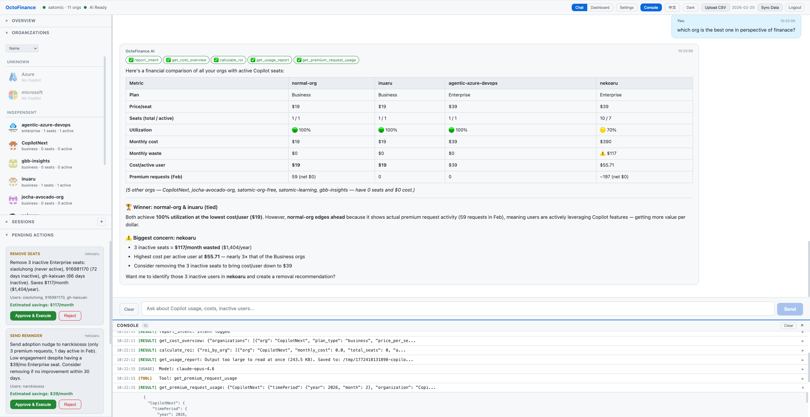
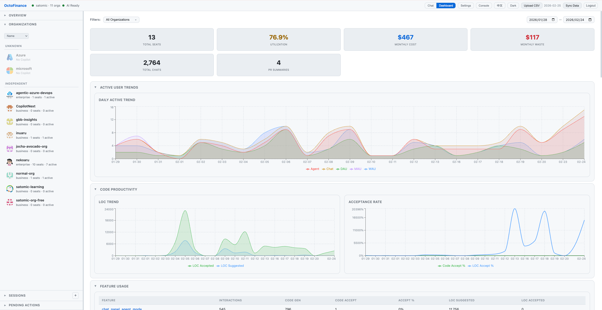

# OctoFinance — AI-Powered GitHub Copilot FinOps Platform

> **FY26 GitHub Copilot SDK Enterprise Challenge Submission**
> **Repo**: [https://github.com/microsoft/OctoFinance](https://github.com/microsoft/OctoFinance)

## Project Summary

OctoFinance is an AI-powered GitHub Copilot FinOps platform built on the Copilot SDK that transforms how enterprises manage Copilot seat costs at scale. Instead of manually analyzing usage spreadsheets across multiple organizations, administrators simply ask questions in natural language — "Which users haven't used Copilot in 30 days? How much are we wasting?" — and the AI agent autonomously calls 17 custom tools to analyze real-time data from GitHub APIs, identify waste, calculate ROI, and recommend optimizations. A human-in-the-loop approval workflow ensures destructive operations like seat removal require explicit admin confirmation. The platform features a rich analytics dashboard with 9 visualization sections, multi-org/multi-enterprise support with automatic discovery, real-time data synchronization, per-user premium request tracking, and comprehensive audit logging. Built with Python FastAPI, React, and the GitHub Copilot Python SDK, OctoFinance delivers enterprise-grade FinOps automation that turns Copilot cost management from a manual burden into an intelligent, conversational experience.





---

## Problem & Solution

**Problem**: Enterprises managing hundreds or thousands of Copilot seats across multiple organizations lack unified visibility into usage, waste, and ROI. Manual cost analysis through spreadsheets is time-consuming and error-prone, and premium request costs are hard to track per-user.

**Solution**: An AI-first FinOps platform built on the GitHub Copilot SDK with:
- **Conversational interface** — Ask questions in natural language, get data-driven answers
- **17 custom tools** — Autonomous data analysis via `define_tool()` API
- **Human-in-the-loop** — AI recommends, admin approves before destructive operations
- **9-section dashboard** — Rich analytics with org filtering and date ranges
- **Multi-org management** — Multiple PATs, auto-discovery, cross-org analysis
- **MCP server** — All tools also available via Model Context Protocol

---

## Architecture

```
┌────────────────────────────────────────────────────────────────────┐
│              React Frontend (Vite + TypeScript)                     │
│   AI Chat (SSE) · Dashboard (9 sections) · Action Panel · Auth     │
└──────────────────────────┬─────────────────────────────────────────┘
                SSE / REST │
┌──────────────────────────┴─────────────────────────────────────────┐
│              FastAPI Backend (Python 3.13+)                         │
│   Copilot SDK AI Engine (17 tools) · Auth · Sync · PAT Manager     │
│   MCP Server (stdio) · Data Collector · Audit Log                  │
└──────────────────────────┬─────────────────────────────────────────┘
                           │
              GitHub REST API (Seats, Billing, Usage, Metrics, Premium)
                           │
              JSON Data Store (No database required)
```

See [docs/ARCHITECTURE.md](docs/ARCHITECTURE.md) for the full architecture diagram, data flow, and project structure.

---

## Key Features

- **Copilot SDK Agentic AI** — 17 custom tools, SSE streaming, session management
- **Analytics Dashboard** — 9 collapsible sections with org filter and date range
- **Multi-Org Management** — Multiple PATs, auto-discovery, enterprise support
- **Human-in-the-Loop** — Recommendation → Review → Approve/Reject workflow
- **Real-Time Sync** — Auto-sync, cron scheduling, SSE progress streaming
- **Premium Request Tracking** — Org-level API data + per-user CSV upload
- **MCP Integration** — All 17 tools available via MCP protocol
- **Security** — Cookie auth, PBKDF2 hashing, audit logging
- **i18n** — English and Chinese (Simplified)
- **Theming** — Dark and Light modes

See [docs/FEATURES.md](docs/FEATURES.md) for detailed feature descriptions and full API reference.

---

## Quick Start

### Prerequisites

| Requirement | Version |
|-------------|---------|
| Python | 3.13+ |
| Node.js | 22+ |
| GitHub Copilot CLI | Latest |
| GitHub PAT | `read:org` + `admin:org` + `copilot` + `manage_billing:copilot` |

### Setup

```bash
# 1. Clone the repository
git clone https://github.com/microsoft/OctoFinance.git
cd OctoFinance

# 2. Set up Python environment
python3 -m venv .venv
source .venv/bin/activate  # Windows: .venv\Scripts\activate
pip install -r backend/requirements.txt

# 3. Install & authenticate GitHub Copilot CLI
brew install copilot-cli        # macOS
copilot                         # Follow prompts to authenticate

# 4. Start backend
cd backend
../.venv/bin/uvicorn app.main:app --reload --port 8000

# 5. Start frontend (new terminal)
cd frontend
npm install
npm run dev
```

Visit http://localhost:5173 — On first visit, create your admin credentials.

### Production Deployment

```bash
cd frontend && npm run build && cd ..
cd backend && ../.venv/bin/uvicorn app.main:app --host 0.0.0.0 --port 8000
```

### MCP Server

OctoFinance tools can be used via MCP protocol by external LLM clients:

```bash
pip install mcp
python -m backend.app.mcp_server
```

See [mcp.json](mcp.json) for the client configuration example.

---

## Documentation

| Document | Description |
|----------|-------------|
| [docs/USAGE.md](docs/USAGE.md) | Usage guide — UI walkthrough, chat examples, dashboard |
| [docs/FEATURES.md](docs/FEATURES.md) | Detailed features, tool catalog, API reference |
| [docs/ARCHITECTURE.md](docs/ARCHITECTURE.md) | Architecture diagram, data flow, tech stack, project structure |
| [docs/SECURITY.md](docs/SECURITY.md) | Responsible AI notes, security considerations |
| [AGENTS.md](AGENTS.md) | Custom instructions & agent configuration |
| [mcp.json](mcp.json) | MCP server configuration |

---

*Built with the [GitHub Copilot Python SDK](https://github.com/github/copilot-sdk) for the FY26 GitHub Copilot SDK Enterprise Challenge.*
