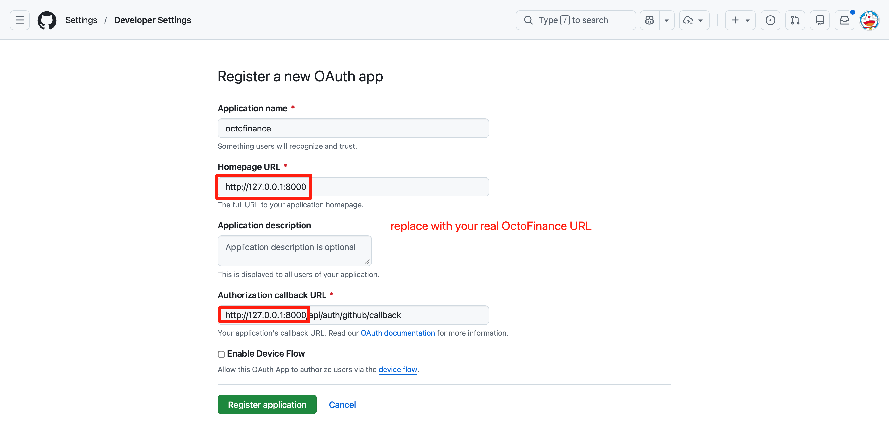
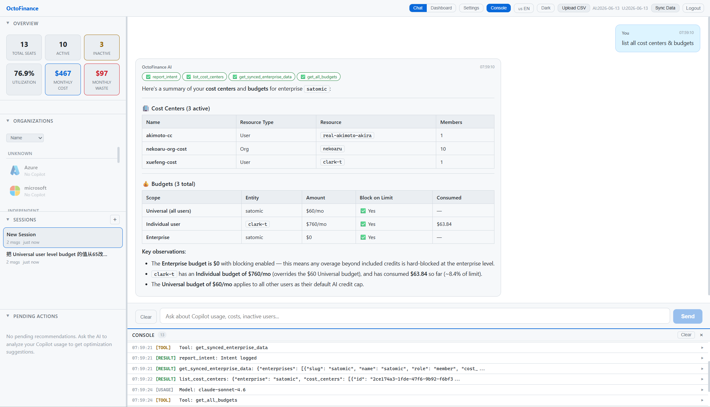
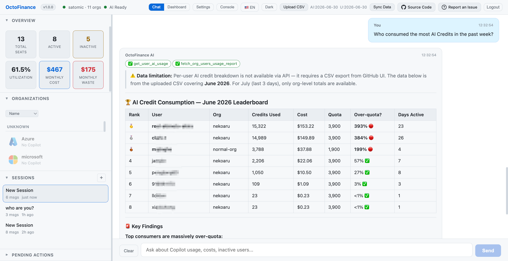
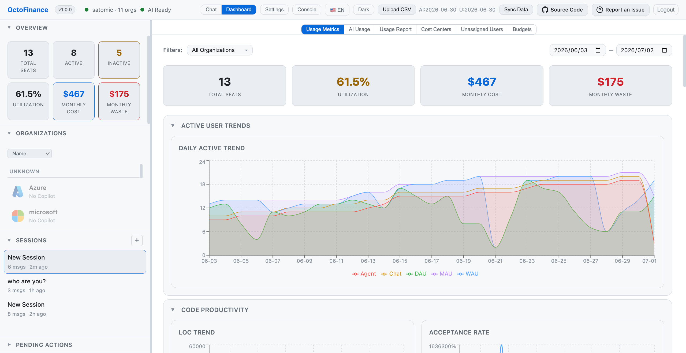
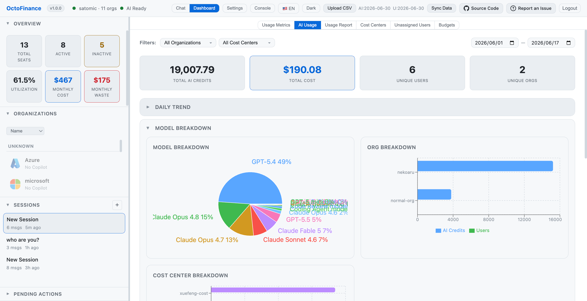
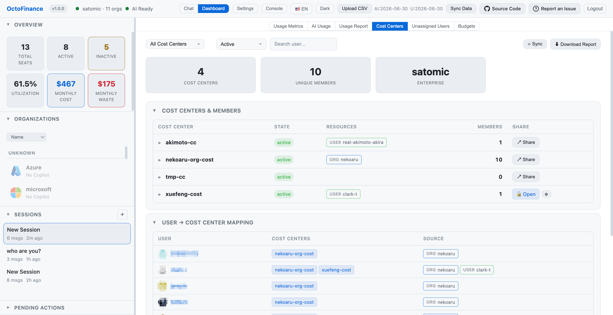
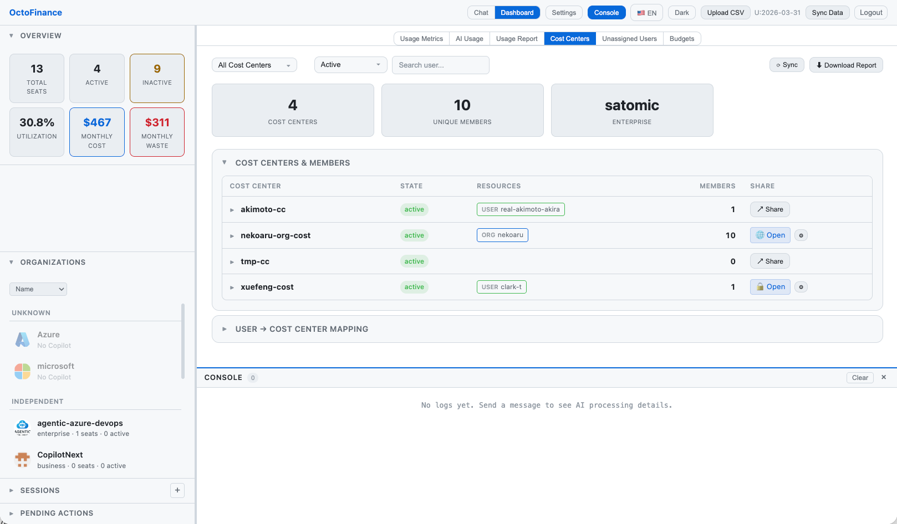
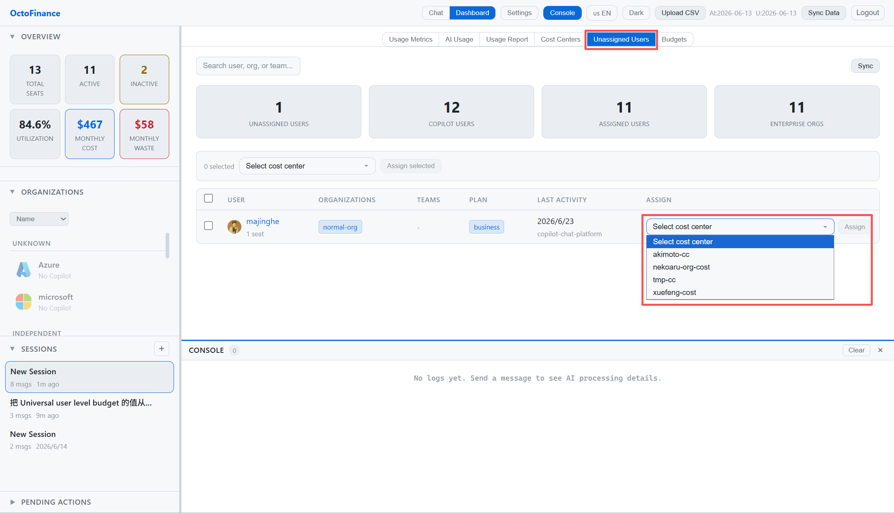
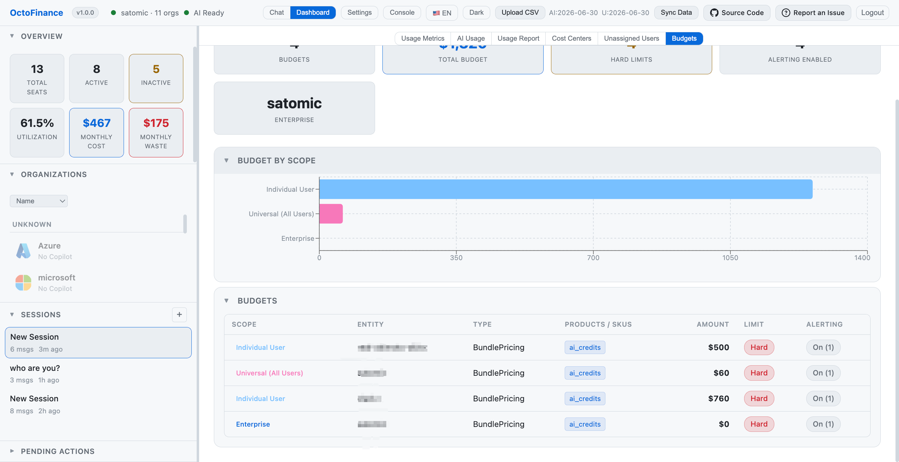

# OctoFinance — AI-Powered GitHub Copilot FinOps Platform

## Project Summary

OctoFinance is an AI-powered GitHub Copilot FinOps platform built on the Copilot SDK that transforms how enterprises manage Copilot seat costs at scale. Instead of manually analyzing usage spreadsheets across multiple organizations, administrators simply ask questions in natural language — "Which users haven't used Copilot in 30 days? How much are we wasting?" — and the AI agent autonomously calls 31 custom tools to analyze real-time data from GitHub APIs, identify waste, calculate ROI, manage UBB budgets, and recommend optimizations. A human-in-the-loop approval workflow ensures destructive operations like seat removal require explicit admin confirmation. The platform features a rich analytics dashboard with 9 visualization sections, multi-org/multi-enterprise support with automatic discovery, real-time data synchronization, per-user AI credit usage tracking, and comprehensive audit logging. Built with Python FastAPI, React, and the GitHub Copilot Python SDK, OctoFinance delivers enterprise-grade FinOps automation that turns Copilot cost management from a manual burden into an intelligent, conversational experience.

---

## Quick Start

The fastest path is Docker — the image is fully self-contained (FastAPI backend + pre-built React frontend + GitHub Copilot CLI, no Node.js runtime needed).

### Option A — Docker (recommended)

```bash
# Pull the latest release (or pin a version, e.g. :v1.1.2)
docker pull ghcr.io/satomic/octofinance:latest

# Start the container
docker run -itd --restart=always \
  --name octofinance \
  -p 8000:8000 \
  -v octofinance-data:/app/data \
  -e COPILOT_GITHUB_TOKEN=github_pat_xxxxxxxxxxxxxxxxxxxx \
  ghcr.io/satomic/octofinance:latest
```

Then open <http://localhost:8000>, create your admin credentials, and add an org-admin data-sync PAT under **Settings → PAT Manager**. Organizations and enterprises are discovered automatically and the first sync starts on its own.

#### You need two different tokens

They serve different purposes and are **not** interchangeable.

| | 1 · Copilot CLI token | 2 · Data-sync PAT |
|---|---|---|
| **What it does** | Authenticates the Copilot CLI / SDK that powers the AI chat | Reads seats, billing, usage and budgets from the GitHub API |
| **How you supply it** | `-e COPILOT_GITHUB_TOKEN=...` at container start | In the web UI: **Settings → PAT Manager** |
| **Token type** | **Fine-grained PAT** (`github_pat_…`) — classic PATs (`ghp_…`) are **not supported** by Copilot CLI | Classic PAT or fine-grained PAT |
| **Owner** | Must be owned by a **personal account** (not an organization) **with an active Copilot subscription** | An organization / enterprise admin |
| **Permissions** | Account permission **Copilot Requests: Read** | `read:org` + `admin:org` + `copilot` + `manage_billing:copilot` |

**Creating the Copilot CLI token (1):** [Settings → Developer settings → Personal access tokens → Fine-grained tokens → Generate new token](https://github.com/settings/personal-access-tokens/new), then under **Permissions → Account permissions** set **Copilot Requests** to **Read-only**. Repository access can stay at *Public repositories* — the token is only used to reach the Copilot API.

Without a valid token 1, dashboards and data sync still work — only the AI chat is unavailable. See [Authenticating GitHub Copilot CLI](https://docs.github.com/en/copilot/how-tos/copilot-cli/set-up-copilot-cli/authenticate-copilot-cli) for the full token-type matrix.

#### Where your data actually lives

`-v octofinance-data:/app/data` mounts a **Docker named volume**. `/app/data` is the path *inside* the container and must not change; `octofinance-data` is the storage on your host, and it is the part you choose.

| What you write | Where the data ends up on the host |
|----------------|-------------------------------------|
| `-v octofinance-data:/app/data` | A Docker-managed named volume. Run `docker volume inspect octofinance-data` to print the real path (typically `/var/lib/docker/volumes/octofinance-data/_data`; on Docker Desktop for macOS/Windows it lives inside the Docker VM, not directly on your filesystem) |
| `-v /opt/octofinance/data:/app/data` | An explicit host directory — use this when you want the files somewhere you can back up, inspect or edit directly |
| `-v "$(pwd)/data:/app/data"` | A `data/` folder next to where you ran the command |

This volume is **required for persistence** — it holds your admin credentials, PATs, OAuth secret, synced GitHub data, budget requests and logs. Without it, everything is lost when the container is removed.

```bash
# Example: keep the data in an explicit host directory
mkdir -p /opt/octofinance/data
# On Linux the container runs as UID 1000, so the directory must be writable by it
sudo chown -R 1000:1000 /opt/octofinance/data

docker run -itd --restart=always \
  --name octofinance \
  -p 8000:8000 \
  -v /opt/octofinance/data:/app/data \
  -e COPILOT_GITHUB_TOKEN=github_pat_xxxxxxxxxxxxxxxxxxxx \
  ghcr.io/satomic/octofinance:latest
```

> `/app/data` contains credentials and billing data. Keep it private — never publish an image or volume containing it.

See [Docker reference](#docker-reference) for the full environment-variable list, local builds and releases.

### Option B — Run from source (development)

**Prerequisites**

| Requirement | Version / details |
|-------------|-------------------|
| Python | 3.13+ |
| Node.js | 22+ |
| GitHub Copilot CLI | Latest — authenticate interactively with `copilot`, or set `COPILOT_GITHUB_TOKEN` to a **fine-grained PAT** with the **Copilot Requests: Read** account permission (classic `ghp_…` tokens are not supported) |
| Data-sync PAT | `read:org` + `admin:org` + `copilot` + `manage_billing:copilot` — added in the web UI, not an env var |

```bash
# 1. Clone the repository
git clone https://github.com/satomic/OctoFinance.git
cd OctoFinance

# 2. Set up Python environment
python3 -m venv .venv
source .venv/bin/activate  # Windows: .venv\Scripts\activate
pip install -r backend/requirements.txt

# 3. Install & authenticate GitHub Copilot CLI
brew install copilot-cli        # macOS
copilot                         # Follow prompts to authenticate

# 4. Start backend
cd backend
../.venv/bin/uvicorn app.main:app --reload --port 8000

# 5. Start frontend (new terminal)
cd frontend
npm install
npm run dev
```

Visit <http://localhost:5173> — on first visit, create your admin credentials. Data is stored in the `data/` directory at the repository root.

**Production build from source**

```bash
cd frontend && npm run build && cd ..
cd backend && ../.venv/bin/uvicorn app.main:app --host 0.0.0.0 --port 8000
```

Behind a reverse proxy, add `--proxy-headers --forwarded-allow-ips="<trusted>"` so the scheme/host are detected correctly and session cookies are marked `Secure` on HTTPS.

### GitHub SSO Login (optional)

Let every Copilot user check their own usage without giving them admin access.

1. [Create a GitHub OAuth App](https://github.com/settings/applications/new): **GitHub → Settings → Developer settings → OAuth Apps → New OAuth App**
   - **Homepage URL**: your OctoFinance URL, e.g. `http://localhost:8000`
   - **Authorization callback URL**: `<your OctoFinance URL>/api/auth/github/callback`
     
2. Log in to OctoFinance as the local admin, open **Settings → GitHub SSO (OAuth App)**, paste the **Client ID** and **Client Secret**, and save.
   (Alternatively set `GITHUB_OAUTH_CLIENT_ID` / `GITHUB_OAUTH_CLIENT_SECRET` environment variables.)
3. A **Sign in with GitHub** button now appears on the login page.

**Roles**

| Role | How it is determined | What they see |
|------|----------------------|---------------|
| Admin | Local username/password login, a GitHub login listed in **Admin GitHub logins**, or the owner of any configured PAT | The full platform — identical for local and SSO logins |
| Regular user | Any other GitHub account | Personal portal only: their own seats, activity, AI credits, spend, **their effective GitHub budget and the cost centers they belong to**, plus the budget request form and history |

Set **Allow any GitHub user to sign in** to off to restrict login to admins and PAT owners only.

**Troubleshooting SSO** — if GitHub authorizes you but you land back on the login page:

- **Browse OctoFinance on exactly the host in the OAuth callback URL.** The session cookie is stored on the callback origin, so opening the app on `http://localhost:8000` while the callback points at `https://octofinance.example.com` cannot work. Leaving **Callback URL** blank auto-detects the browsing origin (reverse-proxy `X-Forwarded-Proto` / `X-Forwarded-Host` headers are honoured). A mismatch is logged as a warning on `/api/auth/github/login`.
- **Behind a reverse proxy, start uvicorn with `--proxy-headers --forwarded-allow-ips="*"`** so the scheme/host are detected correctly and the cookie is marked `Secure` on HTTPS.
- **Multiple workers must share the same `data/` directory** — sessions live in `data/auth_sessions.json`. A `Session cookie presented but not found` warning in the log means the worker serving the request could not see the session.

**User requests** — regular users can raise two kinds of request and follow their status; admins review them under **Dashboard → Requests**.

- **Budget** — a personal AI-credit allowance. Copilot budgets run on a single monthly billing cycle, so there is no period to pick. Approving calls `POST`/`PATCH /enterprises/{slug}/settings/billing/budgets` to create or update a real `budget_scope: "user"` budget.
- **Cost center** — move to a different cost center, chosen from a dropdown pre-selected with the current one. GitHub assigns each user to at most one cost center, so approving calls `POST /enterprises/{slug}/settings/billing/cost-centers/{id}/resource` and GitHub moves the user out of their previous one automatically.

Both require the PAT to carry the **`manage_billing:copilot`** scope; without it the request is still approved in OctoFinance but flagged **GitHub sync failed**, and the admin can retry with the ⟳ button. Untick *"Apply the change to GitHub on approve"* to record an approval without touching GitHub. All records live in `data/budget_requests.json`.

---

## Screenshots

### Chat
> Do you think the current budget setting is reasonable?


> Who consumed the most AI Credits in the past week?


### Dashboards

> Usage Metrics


> AI Usage


> Cost Centers


> Cost Centers


> Unassigned Users


> Budgets


---

## Problem & Solution

**Problem**: Enterprises managing hundreds or thousands of Copilot seats across multiple organizations lack unified visibility into usage, waste, and ROI. Manual cost analysis through spreadsheets is time-consuming and error-prone, and AI credit costs are hard to track per-user.

**Solution**: An AI-first FinOps platform built on the GitHub Copilot SDK with:
- **Conversational interface** — Ask questions in natural language, get data-driven answers
- **31 custom tools** — Autonomous data analysis via `define_tool()` API including budget management
- **Human-in-the-loop** — AI recommends, admin approves before destructive operations
- **Multi-dashboard analytics** — Rich usage, AI credits, budgets, and Cost Center views
- **Multi-org management** — Multiple PATs, auto-discovery, cross-org analysis

---

## Architecture

```
┌────────────────────────────────────────────────────────────────────┐
│              React Frontend (Vite + TypeScript)                     │
│   AI Chat (SSE) · Dashboard (9 sections) · Action Panel · Auth     │
└──────────────────────────┬─────────────────────────────────────────┘
                SSE / REST │
┌──────────────────────────┴─────────────────────────────────────────┐
│              FastAPI Backend (Python 3.13+)                         │
│   Copilot SDK AI Engine (31 tools) · Auth · Sync · PAT Manager     │
│   Data Collector · Audit Log · Budget Management                   │
└──────────────────────────┬─────────────────────────────────────────┘
                           │
              GitHub REST API (Seats, Billing, Usage, Metrics, AI Credits, Budgets)
                           │
              JSON Data Store (No database required)
```

See [docs/ARCHITECTURE.md](docs/ARCHITECTURE.md) for the full architecture diagram, data flow, and project structure.

---

## Key Features

- **Copilot SDK Agentic AI** — 31 custom tools including budget management, SSE streaming, session management
- **Budget Management** — UBB (Usage-Based Billing) AI credits budget controls (Universal/Individual user-level, Enterprise, Cost center)
- **Analytics Dashboard** — Usage, AI credits, budgets, and Cost Center dashboards
- **Cost Center Assignment** — List Copilot users not assigned to any Cost Center, then assign one or many users with confirmation
- **Cost Center Report Sharing** — Share a per-cost-center HTML report page via a tokenized public link (`/share/cc/{token}`), no OctoFinance account required. Each share can be **public** or **password-protected** (PBKDF2-hashed), and can be updated (change password / switch mode) or disabled at any time from the Cost Centers dashboard. The shared page uses the same template as the Download Report export, plus a top-right Download button to save the report as a standalone HTML file. Share settings are persisted in `data/cc_shares.json`
  
- **Multi-Org Management** — Multiple PATs, auto-discovery, enterprise support, including enterprises with **no organizations** (Copilot granted purely via Enterprise Teams) via a per-PAT "Include Organizations" toggle — enterprise-level seats/usage/AI-credit data is synced instead, so the dashboard stays fully populated
- **Human-in-the-Loop** — Recommendation → Review → Approve/Reject workflow
- **Real-Time Sync** — Auto-sync, cron scheduling, SSE progress streaming, with **incremental historical merge** so usage data accumulates beyond GitHub's rolling 28-day reporting window instead of being overwritten on every sync
- **AI Credit Tracking** — Org-level API data + per-user CSV upload
- **GitHub SSO Login** — Sign in with GitHub (OAuth App) alongside the local admin username/password. Admins get the full platform; every other GitHub user gets a self-service portal scoped to their **own** Copilot seat, activity, AI credit consumption and spend. Configure it in Settings → GitHub SSO (persisted in `data/oauth.json`)
- **Budget Requests (provisioned for real)** — Non-admin users submit budget requests; admins review them in Dashboard → Requests and approve with an editable amount. Approving **creates or updates a real GitHub `user`-scope AI-credit budget** via the Billing Budgets API — it is not a number that only lives in OctoFinance. Every decision is recorded with its GitHub sync result (created / updated / failed) and is visible in the **Approval History** tab, with a one-click retry for failed syncs. Persisted in `data/budget_requests.json`
- **Current-month switch** — A top-bar toggle flips every dashboard between full history and the running billing cycle. In current-month mode budgets are read **live from the GitHub API**, so admins and users see the real consumed / remaining amount that decides how much allowance is left this month
- **Personal budget view** — Regular users see their own effective budget (individual, or the universal fallback) with live `consumed_amount`, plus every cost center they belong to and that cost center's budget
- **Security** — Cookie auth, PBKDF2 hashing, role-based API gating (non-admins can only reach `/api/me/*` and `/api/budget-requests`), audit logging
- **i18n** — 7 languages via a dropdown selector: English, 简体中文, 繁體中文, 日本語, 한국어, Tiếng Việt, ไทย. The initial language is auto-detected from the browser; each locale lives in its own file under `frontend/src/locales/`
- **Theming** — Dark and Light modes

See [docs/FEATURES.md](docs/FEATURES.md) for detailed feature descriptions and full API reference.

---

## Docker Reference

OctoFinance ships as a single self-contained image: FastAPI backend + pre-built React frontend + GitHub Copilot CLI (standalone binary, no Node.js runtime needed). Images are published to GitHub Container Registry (GHCR) on every release tag. See [Quick Start](#option-a--docker-recommended) for the run command.

### Configuration

| Item | Description |
|------|-------------|
| Port `8000` | HTTP port serving both the web UI and the API |
| Volume `/app/data` | **Required for persistence.** Holds all runtime state: admin credentials (`auth.json`), PATs (`pats.json`), OAuth config (`oauth.json`), sessions, budget requests, synced GitHub data (one `_latest.json` per category/org — no per-sync snapshots, so the directory does not grow over time), and logs. See [Where your data actually lives](#where-your-data-actually-lives) for named-volume vs. host-directory mounts |
| Env `COPILOT_GITHUB_TOKEN` | Token used to authenticate the **Copilot CLI / SDK** ([docs](https://docs.github.com/en/copilot/how-tos/copilot-cli/set-up-copilot-cli/authenticate-copilot-cli)). Must be a **fine-grained PAT** (`github_pat_…`) owned by a **personal account** with an active Copilot subscription and the **Copilot Requests: Read** account permission. **Classic PATs (`ghp_…`) are not supported.** OAuth (`gho_…`) and GitHub App user tokens (`ghu_…`) also work |
| Env `GH_TOKEN` / `GITHUB_TOKEN` | Standard GitHub CLI token env vars — same purpose as `COPILOT_GITHUB_TOKEN`, lower precedence |
| Env `COPILOT_CLI_PATH` | Pre-set to `/usr/local/bin/copilot` inside the image — do not override |
| Env `GITHUB_OAUTH_CLIENT_ID` | Optional. GitHub OAuth App client ID for SSO login (can also be set in Settings → GitHub SSO) |
| Env `GITHUB_OAUTH_CLIENT_SECRET` | Optional. GitHub OAuth App client secret for SSO login |
| Env `GITHUB_OAUTH_CALLBACK_URL` | Optional. Overrides the auto-detected OAuth callback URL (`<origin>/api/auth/github/callback`) |

**Separation of concerns**:

- **Data-sync PATs** (org-admin PATs used to pull seats/usage/billing from the GitHub API) are configured **via the web UI only** (Settings → PAT Manager) and persisted in `/app/data/pats.json`. They are *not* configurable through Docker environment variables.
- **Docker env vars are only for Copilot CLI / SDK authentication.** The container is headless, so interactive `copilot` login is not possible — pass a fine-grained PAT from a Copilot-subscribed personal account instead. Resolution order:
  1. `COPILOT_GITHUB_TOKEN` > `GH_TOKEN` > `GITHUB_TOKEN` environment variables
  2. Fallback: the first PAT configured in the web UI (only works if that PAT is a fine-grained token whose owner has a Copilot subscription and the `Copilot Requests` permission)


> **Notes**
> - The container runs as non-root user `octofinance` (UID 1000). If you bind-mount a host directory on Linux, make sure it is writable by UID 1000 (`chown -R 1000:1000 ./data`).
> - The token used for Copilot CLI auth must be a **fine-grained PAT with the `Copilot Requests` account permission**, owned by a personal account with an active Copilot subscription. A classic PAT will fail authentication. Without it the AI chat will not work (data sync and dashboards still will).
> - PATs and billing data live in `/app/data`. Never publish an image or volume containing this directory.
> - Changes to token env vars require recreating the container (`docker rm -f octofinance` + `docker run ...`).

### Build locally

```bash
# Build octofinance:dev for your local architecture
./scripts/docker-build.sh

# Build with a specific tag
./scripts/docker-build.sh v1.1.2

# Cross-build for another platform
PLATFORM=linux/amd64 ./scripts/docker-build.sh
```

### Release via GitHub Actions

Pushing a tag triggers [.github/workflows/docker-publish.yml](.github/workflows/docker-publish.yml), which builds multi-arch images (`linux/amd64` + `linux/arm64`) and pushes them to GHCR:

```bash
git tag v1.1.2
git push origin v1.1.2
# → publishes ghcr.io/<owner>/<repo>:v1.1.2, :1.1.2, :1.1, :1 and :latest
```

Every tagged build also updates the `latest` tag.

> **Image internals**: the image bundles the standalone Copilot CLI binary (pinned via the `COPILOT_CLI_VERSION` build arg in the [Dockerfile](Dockerfile), currently `1.0.68`) and points the Copilot Python SDK (`github-copilot-sdk>=1.0.5`) at it via `COPILOT_CLI_PATH`, so no CLI download happens at container runtime. CLI and SDK must speak the same SDK protocol version (both currently v3).

---

## Documentation

| Document | Description |
|----------|-------------|
| [docs/USAGE.md](docs/USAGE.md) | Usage guide — UI walkthrough, chat examples, dashboard |
| [docs/FEATURES.md](docs/FEATURES.md) | Detailed features, tool catalog, API reference |
| [docs/ARCHITECTURE.md](docs/ARCHITECTURE.md) | Architecture diagram, data flow, tech stack, project structure |
| [docs/SECURITY.md](docs/SECURITY.md) | Responsible AI notes, security considerations |
| [AGENTS.md](AGENTS.md) | Custom instructions & agent configuration |

---

*Built with the [GitHub Copilot Python SDK](https://github.com/github/copilot-sdk)*
