# OctoFinance 完整使用指南

适用版本：**v1.5.1**。[English](USER_GUIDE_EN.md)

OctoFinance 用于集中查看 GitHub Copilot 席位、采用情况、AI credits、账单与预算，并通过 AI 对话辅助成本治理。本指南按三个角色介绍功能；英文界面标签保留在操作步骤中，方便对照截图。

所有截图均为**英文界面、白色主题**，中英文指南共用图片。少数截图来自较早版本，页签数量和控件位置可能略有不同，以本文说明为准。角色视图截图，以及原本会展示真实账号的表格，均使用 `alex-demo` 这样的示例登录名，不代表真实人员、预算或授权。

**目录**

1. [管理员：配置、分析与治理](#admin)
2. [Cost Center Owner：管理自己的成本中心](#owner)
3. [普通用户：查看个人用量与提交申请](#user)

| 功能范围 | 管理员 | Cost Center Owner | 普通用户 |
|----------|--------|-------------------|----------|
| 全局 dashboard、AI 对话、同步、CSV 导入 | 可以，在 PAT 权限范围内 | 不可以 | 不可以 |
| 个人用量与个人申请 | 使用管理员工作台 | 可切回个人视图 | 可以 |
| 成本中心用量与成员明细 | 可以 | 仅被授权的中心 | 仅自己的归属与相关摘要 |
| 修改 AI Credit Cap | 可以，受 GitHub 条件限制 | 不可以，只读 | 不可以 |
| 直接设置成员个人预算 | 可以 | 仅合格成员，且 Cap 经验证开启 | 不可以，需申请 |
| 授予 owner、审批申请、配置 PAT/SSO | 可以 | 不可以 | 不可以 |

> **先区分计量：**席位是访问授权；AI credits 是模型消耗计量；预算是美元金额控制。`input`、`output`、`cache_read`、`cache_write` 是报表提供的额外计量，不能直接当作 credits 或金额相加。页面数据受最近同步、报表覆盖和权限影响，不等同于最终实时账单。

<a id="admin"></a>
## 第一章：管理员

### 1.1 身份与首次使用

管理员包括本地管理员账号、GitHub SSO 管理员名单中的账号，以及已配置 PAT 的所有者。其他 GitHub 用户通常进入个人门户，owner 则额外获得指定成本中心视图。

建议按以下顺序初始化：

1. 打开部署地址。开发环境通常为 `http://localhost:5173`，生产使用部署方提供的域名。
2. 首次访问时创建本地管理员账号，妥善保存凭据。
3. 在 **Settings** 中添加数据同步 PAT，确认组织与企业范围。
4. 执行 **Sync Data**，在 **Console** 检查同步结果。
5. 使用 **Fetch CSV** 或 **Upload CSV** 获取详细账单数据。
6. 配置 GitHub SSO，验证普通用户能够登录。
7. 在成本中心成员列表中指定负责人，验证其角色选择和数据范围。

环境准备和部署方式见 [README](../README.md)。普通用户无需自行配置 PAT 或安装 Copilot CLI。

### 1.2 PAT 与企业范围

打开 **Settings > GitHub Personal Access Tokens**。

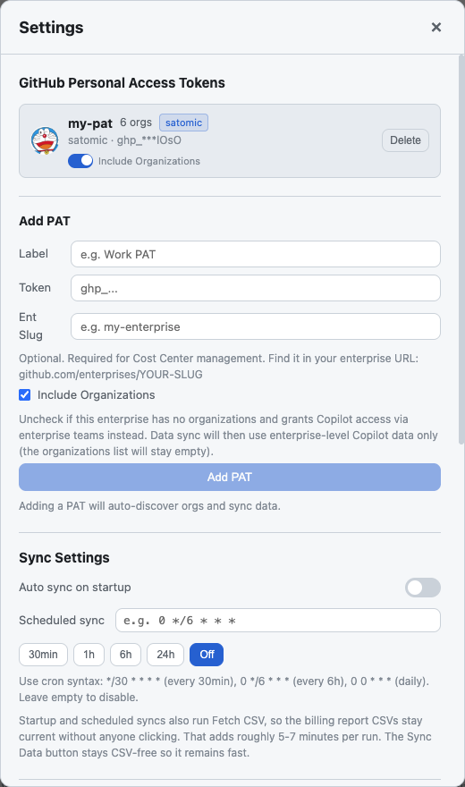

已保存的令牌以掩码形式显示（如 `ghp_***lOsO`），并附带 GitHub 所有者和已发现的组织数量。同一面板往下还包含 Sync Settings、CSV Fetch 和 GitHub SSO。

| 字段 | 作用 |
|------|------|
| Label | 便于识别的令牌名称。保存后使用标签展示，GitHub 所有者另行显示 |
| Token | 数据同步 PAT，不要放入截图、对话或共享文件 |
| Host | github.com 留空；GHE.com（带数据驻留的 GitHub Enterprise Cloud）填写租户主机，例如 `acme.ghe.com`，该令牌随后调用 `api.acme.ghe.com` |
| Ent Slug | 企业 URL 中的标识，例如 `github.com/enterprises/example-enterprise` 中的 `example-enterprise`；自动发现不完整时显式填写。也可以直接粘贴完整 URL（如 `https://acme.ghe.com/enterprises/acme`），系统会提取 slug，Host 留空时同时从 URL 取得主机 |
| Include Organizations | 是否扫描组织；只使用 Enterprise Teams 且无需组织扫描时可关闭 |

点击 **Add PAT** 后进行验证与发现，数据同步在后台运行。可配置多个 PAT 覆盖不同管理范围；发现某组织不等于拥有其全部账单和管理权限。

**组织扫描与企业 seats 获取相互独立。**勾选 Include Organizations 不应阻止企业席位同步；企业补充席位在读取统计时排除已由组织覆盖的席位，避免重复计数。无组织企业的 Organizations 列表可以为空，不代表没有 Copilot 席位。

**GHE.com（数据驻留）。**每个 PAT 只属于一个主机，非 github.com 的主机会以标签形式显示在 PAT 旁。该 PAT 的数据同步、CSV 获取、成本中心、预算与 Enterprise Teams 操作都发往其主机，仪表板和成本中心报告里的用户链接也指向同一主机。github.com 与 GHE.com 的 PAT 可以同时配置，但两边同名的组织或企业 slug 会共用一份数据文件，请保持 slug 不重名。有防火墙的部署需放行到 `api.<租户>.ghe.com`、`copilot-reports.<租户>.ghe.com`、`<租户>.ghe.com` 和 `*.blob.core.windows.net` 的 HTTPS 出站。详见 [GHE.com 兼容性报告](GHE_COMPATIBILITY.md)。

修改组织扫描开关会重新发现范围并触发同步。移除 PAT 会影响后续数据访问，但不会取消 GitHub 席位，也不会自动撤销 GitHub 上的令牌。

| 权限或凭据 | 主要用途与边界 |
|------------|----------------|
| `read:org`、适用的组织管理权限 | 组织发现、组织席位与账单读取，仍受账号角色与具体端点限制 |
| `copilot` 或适用的 Copilot 权限 | Copilot 用量等数据 |
| `manage_billing:copilot` | Copilot 预算写入及相关成本中心管理，需要相应管理角色 |
| `manage_billing:enterprise` | 自动请求详细账单 CSV，需企业管理员或账单管理员身份 |
| Classic PAT 的 `read:enterprise` | Enterprise Teams 读取 |
| Classic PAT 的 `admin:enterprise` | Enterprise Teams 创建和修改 |
| Copilot CLI 独立认证 | AI 对话；不是数据同步 PAT 自动提供的能力 |

Enterprise Teams 接口不接受 fine-grained PAT 或 GitHub App token。GHE.com 租户的对话令牌必须在该租户上创建。OctoFinance 会判断令牌属于哪个已配置的 GHE.com 主机（来自 PAT 或 SSO 主机），并自动让 CLI 指向该主机；启动后才添加 GHE.com PAT 时也会自动切换。令牌只会发往这些已配置的主机校验。如需手动指定，设置 `COPILOT_GH_HOST=<租户>.ghe.com`（或 `GH_HOST`），手动设置始终优先。Classic PAT 不会用于对话，因为 CLI 拒绝此类令牌。AI 对话使用 Copilot CLI/SDK 的认证流程；使用令牌时遵循 CLI 对个人账号、有效 Copilot 订阅及 Copilot Requests 权限的要求，见 [CLI 认证说明](https://docs.github.com/en/copilot/how-tos/copilot-cli/set-up-copilot-cli/authenticate-copilot-cli)。

### 1.3 GitHub SSO

1. 在 GitHub 的 **Settings > Developer settings > OAuth Apps** 创建 OAuth App。GHE.com 需在租户（`https://<租户>.ghe.com`）上创建，并在 **GitHub host** 字段填写该主机；github.com 上的 OAuth App 无法登录 GHE.com 用户。
2. Homepage URL 填 OctoFinance 实际访问地址。
3. Callback URL 填 `https://你的域名/api/auth/github/callback`。
4. 在 OctoFinance 的 **GitHub SSO** 设置填写 Client ID、Client Secret，核对回调 URL。
5. 设置管理员 GitHub 登录名列表，以及 **Allow any GitHub user to sign in** 策略。
6. 在独立会话中测试管理员与普通用户登录。

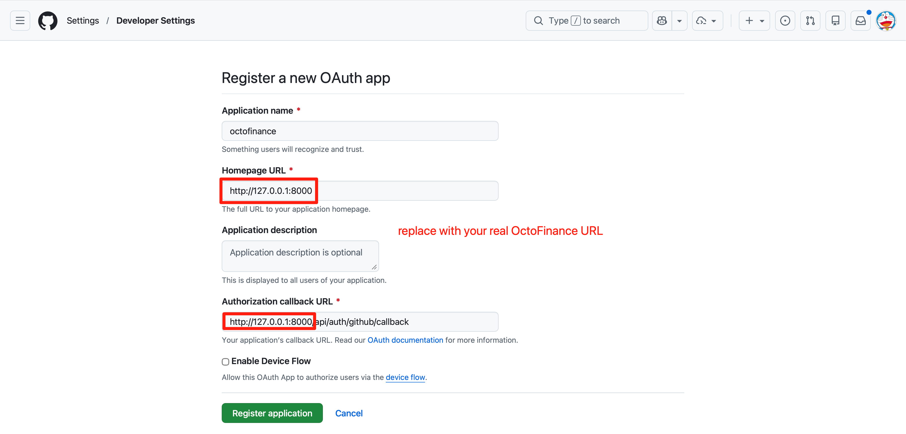

关闭普通用户登录策略可能阻止 owner 和普通用户进入门户。SSO 不自动分配 Copilot 席位，也不自动授予 owner 身份。

浏览地址和回调必须使用匹配的域名与协议。`localhost`、`127.0.0.1` 与生产域名不能共享登录 Cookie。反向代理需正确传递原始协议和主机，多进程部署需共享会话存储。

### 1.4 导航、主题与时间范围

| 入口 | 用途 |
|------|------|
| Chat / Dashboard | AI 对话与八个数据页签 |
| All Time / Current Month | 已收集历史数据或当前账期 |
| Settings | PAT、同步周期、CSV 拉取参数、SSO |
| Console | 工具与同步进度、失败详情 |
| Sync Data / Fetch CSV / Upload CSV | API 同步、自动拉取报表、手动导入报表 |
| 用户菜单 | 身份、语言、主题和退出 |
| Overview / Organizations | 席位费用摘要与组织范围 |
| Sessions / Pending Actions | 会话管理与 AI 建议审阅 |

支持八种语言。主题、语言、筛选、折叠状态等在当前浏览器保存；可折叠区域点击标题展开，宽表格可横向滚动，侧边栏可调整宽度。

**Current Month 不代表所有数据实时。**CSV 只过滤已导入的本月记录；预算页和个人预算支持实时读取，但应核对来源与错误提示。席位、成员等快照反映最近同步，日期筛选不能还原任意历史时点的授权。

### 1.5 同步与 CSV 数据维护

Sync Settings 和 CSV Fetch 位于 1.2 截图中的同一个设置面板。

| 数据来源 | 内容 |
|----------|------|
| API 缓存 | 席位、账单摘要、Copilot 用量、成本中心、预算、Enterprise Teams |
| AI Usage CSV | 每用户、每模型的 credits、金额、配额、输入输出缓存字段 |
| Usage Report CSV | 按产品、SKU、用户、组织和成本中心划分的账单明细 |

| 触发方式 | API 数据 | CSV |
|----------|----------|-----|
| Sync Data | 更新 | 不拉取 |
| Auto Sync on Startup | 更新 | 随后拉取 |
| Sync Cron Schedule | 更新 | 随后拉取 |
| Fetch CSV | 不执行全量同步 | 请求、等待、下载并导入 |
| Upload CSV | 不执行全量同步 | 导入所选文件 |

**手动同步：**点击 Sync Data 后查看 Console。部分数据集失败不意味着全部同步失败，检查具体组织、端点与状态，再修复权限并重试。

**定时同步：**可开启启动同步，选择预设周期或填写 Cron。前一任务仍运行时，定时触发会跳过，避免堆积。CSV 失败会记录，不应将其误判为全部 API 数据不可用。

**失败提醒：**每次同步（包括定时同步）都会先用 GitHub 校验每个 PAT。令牌被拒绝（过期或被撤销）、被禁止访问、无法连接 GitHub，或同步过程中出现错误时，状态栏下方会出现红色提醒，显示失败的同步任务以及**最近一次成功同步**的时间，避免误以为定时任务在正常更新数据。点击 **Fix in Settings** 打开 PAT 列表，出问题的 PAT 会带有标记，点击 **Replace token** 即可直接更换令牌，无需删除后重新添加。PAT 在 7 天内过期时显示黄色提醒。Dismiss 只隐藏到下一次失败为止。同步结果保存在 `data/sync_status.json`，重启后依然保留。

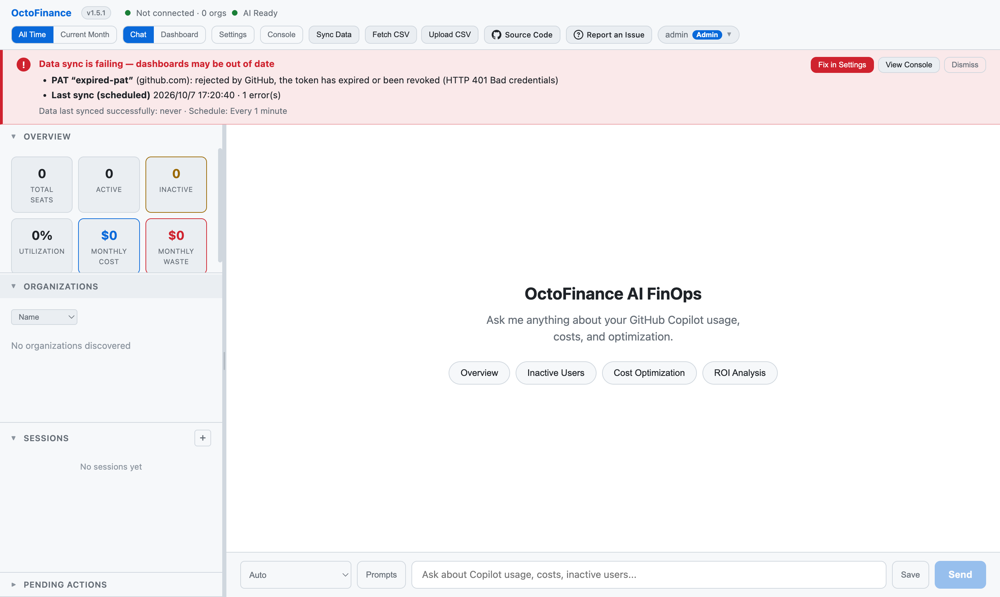

**自动报表：**Fetch CSV 请求最近 31 天的 `ai_credit` 与 `detailed` 报表。GitHub 生成通常需要数分钟，可能更久；Settings 中的轮询间隔和超时控制等待，Console 显示进度。刷新页面不会等于重新创建报表，可查看仍在运行的任务。

**手动导入：**从 GitHub 导出完整的详细报表，点击 Upload CSV，系统自动识别类型。导入后检查顶部 CSV 覆盖日期和目标页签。汇总报表不能代替需要每用户维度的详细报表。

> **按日期整体替换：**新导出覆盖某一天时，该日已存记录会全部被替换；未覆盖日期保留。不要上传只保留某个用户或组织的裁剪文件，否则会删掉同一天其他记录。重复导入同一完整数据不会追加重复消耗。

历史范围是已经收集的数据，不是自动补全 GitHub 的全部历史。旧 CSV 缺少额外计量列时不会凭空补值；后续导入的列集合会保留这些字段。

### 1.6 AI 对话与治理建议

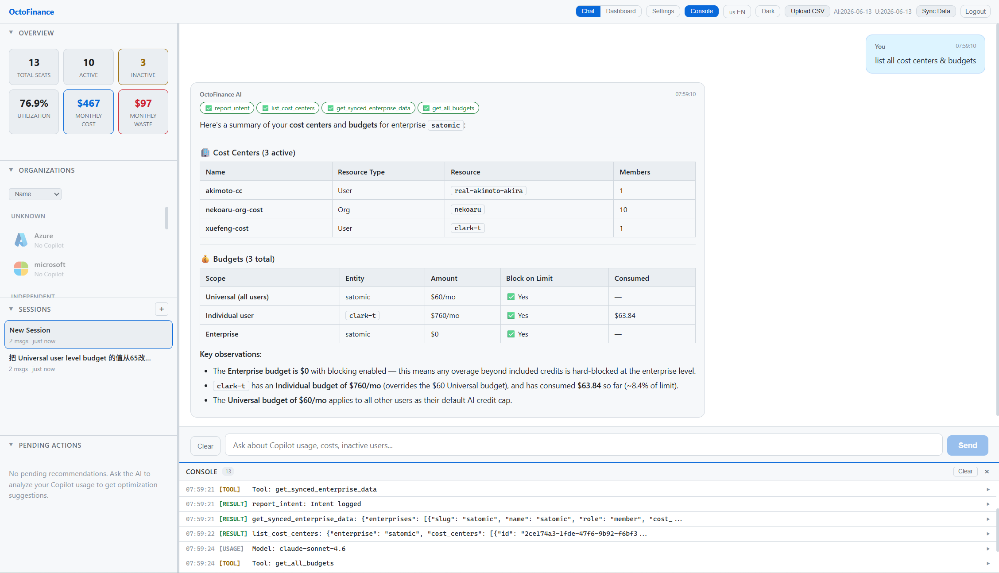

既有截图用于说明对话与侧边栏结构；模型和数据以当前环境为准。

1. 新建会话，选择 Auto 或当前账号可用的模型。
2. 明确企业或组织、时间范围和希望分析的问题。
3. 核对工具调用、数据来源、日期及具体数值。
4. 对写操作先核对目标、影响与审批要求。
5. 在 Pending Actions 中审阅已记录的建议，批准执行或拒绝。

**对话凭据。**在 **Settings > AI Chat (Copilot)** 中配置对话所用的账号：填写拥有有效 Copilot 席位和 Copilot Requests 权限的用户的 fine-grained PAT，主机可选（留空会自动识别 github.com 或 GHE.com 主机）。在此保存的令牌优先于环境变量 `COPILOT_GITHUB_TOKEN`，保存后对话会重新连接，无需重启。状态行显示令牌来源，以及对话实际登录的账号和主机，并说明失败原因：令牌被拒绝（此时对话会回退到本机 Copilot CLI 登录），或 Copilot 报告的席位、策略问题（例如 `403 not authorized to use this Copilot feature`）。

```text
Compare Copilot utilization across organizations using the latest synced data.
Find users inactive for 30 days. Create recommendations only; do not remove seats.
Which models consumed the most AI credits this month? Include the source period.
List cost centers and budgets in example-enterprise without making changes.
Explain shared cost center budgets versus per-member budgets before creating one.
```

**常用提示词。**日常反复使用的分析问题可以保存下来，不必每次重新输入：点击输入框旁的 **Save**（或将鼠标悬停在自己发送过的消息上，点击 **Save** 标签），填写标题，并可选择共享给其他管理员。点击输入框左侧的 **Prompts** 打开提示词库：单击某条提示词会填入输入框，修改后再发送；点击 **Run** 则直接发送。其他管理员共享的提示词显示 *Shared by &lt;login&gt;*，只能使用，不能修改或删除。提示词保存在服务端（`data/saved_prompts.json`），换浏览器或电脑后依然可用。

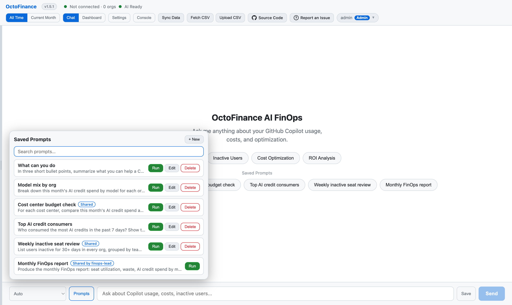

Sessions 支持新建、切换、重命名和删除。Send 发送，Stop 停止当前响应，Clear 清理对话。会话保留多轮上下文，切换模型影响后续消息，不改变业务权限。

AI 工具覆盖席位、用量、账单、成本中心、预算与 Enterprise Teams。部分管理功能由 AI 工具提供，不代表每种操作都有独立表单。**确认或批准执行会调用真实 API**；并非所有写操作必然先生成相同审批面板条目。移除席位、成员、预算或中心前应明确业务授权，日志不能替代事前确认。

### 1.7 Usage Metrics

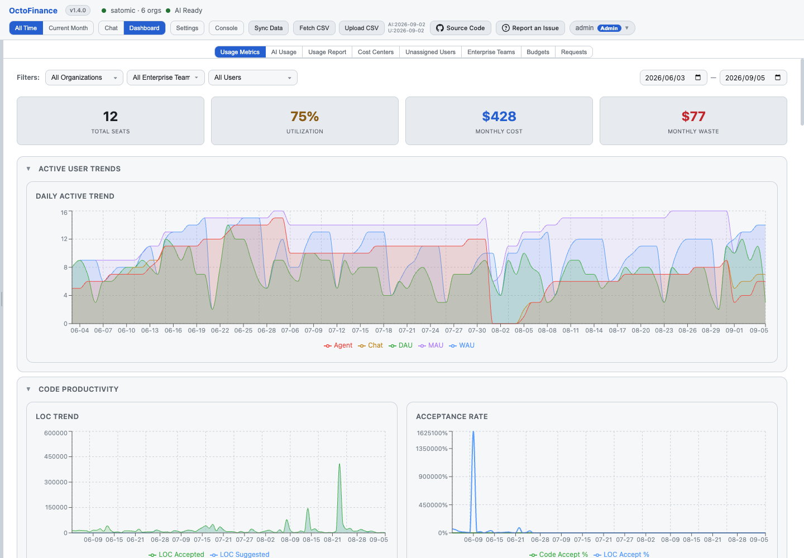

该页使用 API 用量与席位数据，回答“是否在用、使用哪些功能、哪些席位可能闲置”。

| 区域 | 解读 |
|------|------|
| KPI | 席位、活跃、利用率、估算月费与闲置成本 |
| Active User Trends | DAU、WAU、MAU，以及 Chat、Agent 采用趋势 |
| Code Productivity | 生成与接受活动、代码行数与接受率 |
| Feature / Language / IDE / Model | 功能与开发环境的采用结构 |
| Seat Management | 账号、计划、团队、分配日期、最近活动与待取消状态 |
| Top Active Users | 已收集范围内较活跃的用户 |

使用组织、企业团队、用户和日期筛选。团队通过同步名单按 GitHub 登录名关联；团队筛选下的部分聚合由用户级报告重建，不能假定与组织级原始汇总完全一致。

席位月费与闲置成本是估算，不是最终账单。没有活动不自动代表应删除席位，应核对入职、休假、工作职责和授权方式。代码行数与接受率也不应单独作为个人绩效依据。

### 1.8 AI Usage 与输入输出缓存

该页使用 AI credit 详细 CSV。先确认数据覆盖，再按组织、成本中心、团队、用户和日期筛选。查看总 credits、费用、每日趋势、模型与组织分布，在用户表中查看配额、活跃天数与 Auto 模型占比。可排序表头支持按字段比较。

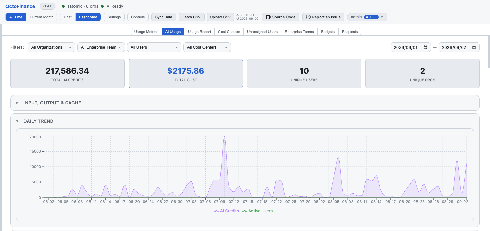

| 字段 | 显示内容 | 注意 |
|------|----------|------|
| `input` | 输入计量 | 保持报表原值，不折算 credits |
| `output` | 输出计量 | 不等于接受的代码行数 |
| `cache_read` | 缓存读取 | 不直接等于节省金额 |
| `cache_write` | 缓存写入 | 与读取分开展示 |

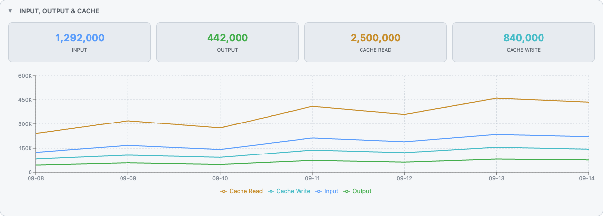

四项指标有总量、趋势、模型与用户明细。缺列、空白或无效值显示 **Not reported**，真实零显示 `0`。混合新旧 CSV 时只汇总已提供值，覆盖记录可能少于 credits 和金额；不能把缺失当作零消耗。已有 CSV 包含这些列时无需重新导入。

### 1.9 Usage Report

Usage Report 侧重产品和 SKU，AI Usage 侧重模型。它展示每日金额、产品与 SKU 分布、组织和中心汇总、每用户账单明细。按当前页提供的产品、SKU、组织、中心、团队、用户和日期条件过滤。

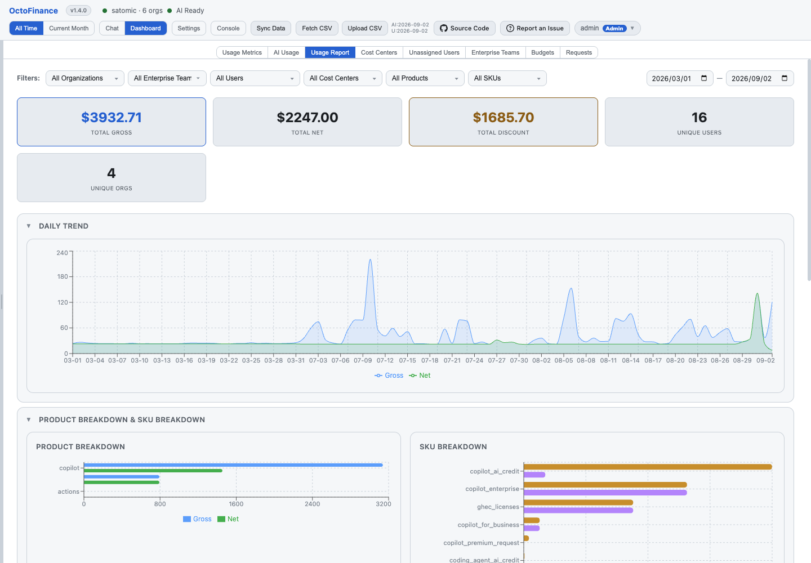

| 金额 | 含义 |
|------|------|
| Gross | 报表原始金额 |
| Discount | 报表折扣 |
| Net | 折扣后金额 |

对账时统一期间、范围和 gross/net 口径。AI Usage gross、Usage Report net、席位估算与预算 consumed 可能覆盖重叠费用，不能直接相加当作总账单。

### 1.10 Cost Centers、Cap 与 owner 授权

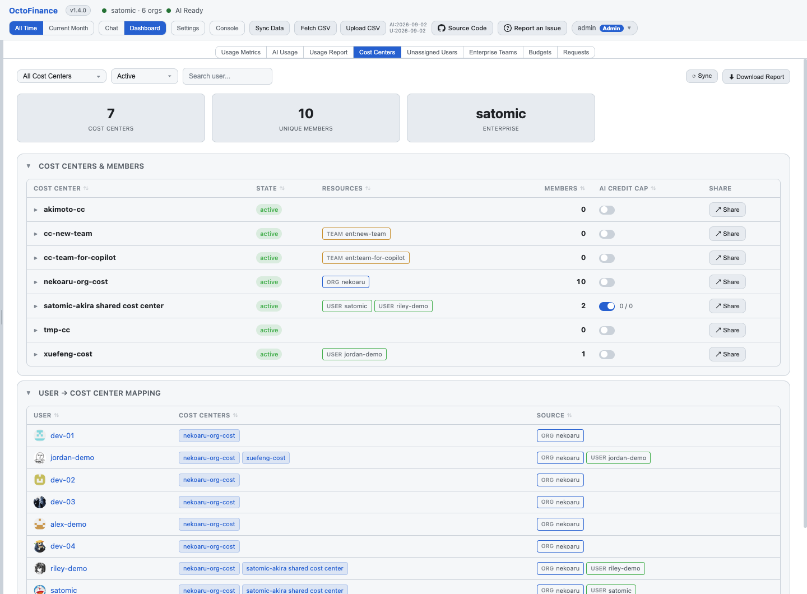

成本中心表格每行带有 Cap 开关和 Share 入口；下方映射表展示每个用户是直接归属，还是通过组织或团队资源继承。

选择企业和中心，过滤活跃或归档状态，展开查看成员与资源来源。成本中心创建、重命名和资源管理也可通过管理员 AI 工具进行；新建中心的 included usage cap 默认开启，仍以 GitHub 返回为准。

**AI Credit Cap** 是 GitHub 的 included usage cap：开启后，中心受成员许可证包含额度约束，而非继续从共享企业池消耗。它不是任意设置的美元预算。只有管理员能切换；不满足 GitHub 资源类型条件的中心可能不可编辑。界面先更新开关，失败则回退并提示，Console 记录过程。

**指定负责人：**

1. 展开活跃中心，找到成员。
2. 打开该成员的 **Cost center owner** 开关。
3. 请对方用对应 GitHub 账号登录，在角色下拉框选择中心。
4. 核对其仅能访问授权范围。

可有多个 owner，一人可负责多个中心。撤销 owner 不等于移除成员或席位。中心成员、owner、管理员是不同概念。

**Download Report** 下载独立 HTML 报告。**Share** 创建公开或密码保护链接，可修改或停用；持链接者不必登录，也不获得 owner 权限。按财务与人员数据要求分发，停用链接不会收回已经下载的文件。

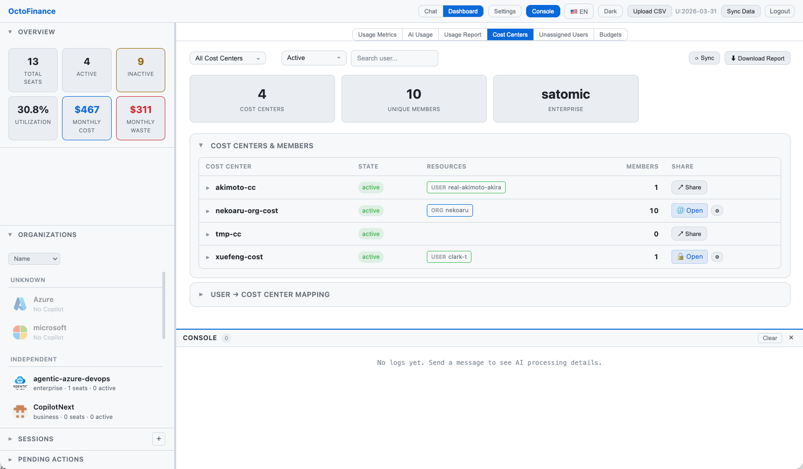

### 1.11 Unassigned Users

候选以已获取的 Copilot 席位持有者为基准，排除已属于活跃成本中心的用户；不是通讯录全员，也不是没有席位的人。归档或删除中心不作为有效归属。

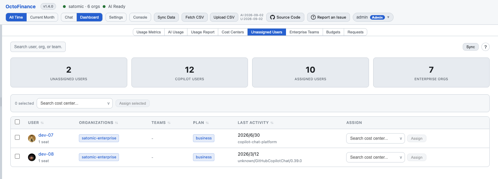

1. 选择企业，搜索用户，检查数据是否已同步。
2. 勾选目标账号并选择成本中心。
3. 核对确认信息后批量分配。
4. 检查每个账号的结果并刷新。

企业团队直接授权的席位也应纳入，不要求必须有组织。列表为空可能确实已全部归属，也可能数据尚未同步。分配修改真实 GitHub 归属。

### 1.12 Enterprise Teams

该页展示团队成员、分配的组织、匹配席位、活跃成员、用量与估算成本。展开行看成员明细，另有未被团队覆盖的席位持有者。专用 Sync 刷新团队数据，其他用量页中的 Enterprise Team 和 No enterprise team 筛选依赖该名单。

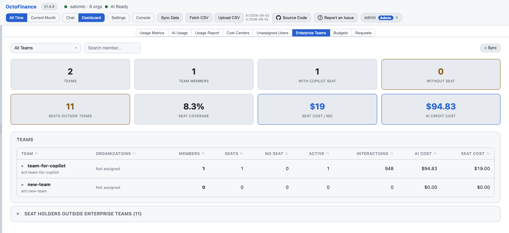

GitHub 用量没有原生企业团队字段，系统按登录名关联。用户可属于多个团队，各团队人数或消耗不能直接累加为全企业唯一总量。成员数大于匹配席位数不一定是错误。

团队创建、修改、成员与组织关联通过管理员 AI 工具处理，需要写权限。当前不管理 GitHub 的团队模型可用性策略。

### 1.13 Budgets

按企业、scope 和关键字查看金额、已用、剩余、比例与 hard/soft limit，必要时实时刷新并核对数据来源。

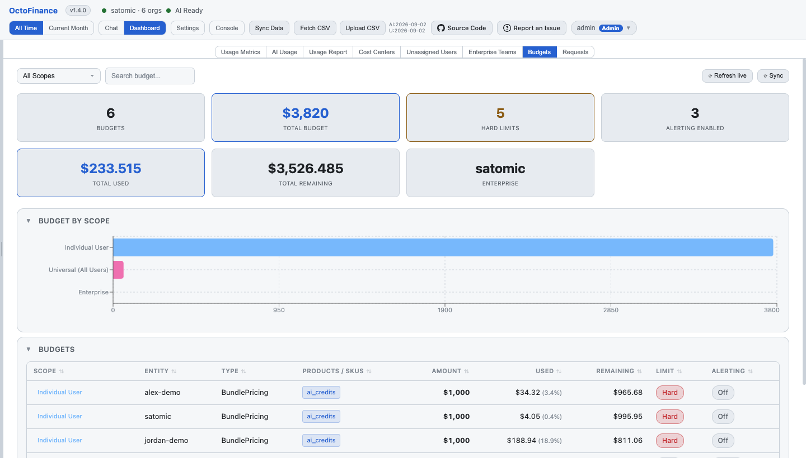

| 范围 | 含义 |
|------|------|
| Universal / `multi_user_customer` | 全体用户适用的统一个人预算规则，不是共同分一笔总额 |
| Individual / `user` | 指定用户个人预算 |
| `cost_center` | 中心共享预算 |
| `multi_user_cost_center` | 中心各成员适用相同的个人预算规则 |
| 企业、组织、仓库等 | 按 GitHub 返回的对应范围展示 |

创建、修改、删除及批量个人预算可通过 AI 工具操作，个人预算也可经申请审批设置。明确 scope、目标、金额和 hard limit。更新不用于直接改变 scope；变更范围前评估新旧规则。

Copilot 预算按月度账期、美元金额管理。Hard limit 达限后阻止相应范围继续使用，soft limit 不等于阻断。个人预算、许可证包含额度和中心 Cap 不能互相替代。

### 1.14 Requests：审批与执行结果

Review 展示预算和成本中心两类申请，History 展示提交、审批、金额调整和重试等记录。

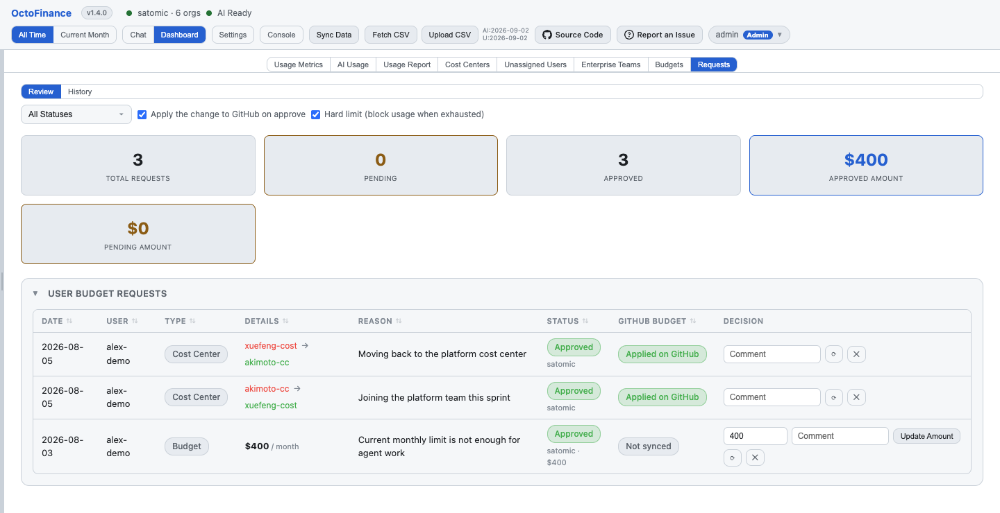

1. 筛选 pending，核对申请人、类型、理由及目标。
2. 预算申请可调整批准金额；中心申请核对原中心与目标中心。
3. 设置审批意见，以及预算的 hard limit。
4. 检查 **Apply the change to GitHub on approve** 是否开启。
5. 批准或拒绝，并检查 GitHub 写回状态。

| 执行状态 | 后续 |
|----------|------|
| Created / Updated / Applied | 已获得成功结果，核对目标范围 |
| Partially applied | 检查成功与失败步骤，不假定全部完成 |
| Failed | 修复权限或目标错误后重试同步 |
| Not synced / Skipped | 可能仅本地审批，未写 GitHub |

**Approved 不等于 GitHub 已生效。**写回失败或主动关闭写回时，仍可能存在批准记录。个人中心变更可能将用户移出之前的中心；继承自组织或团队的关系不能简单按单用户处理。

### 1.15 Console、排错与日常巡检

Console 显示带时间的工具执行与同步进度；AI 正在启动不必然阻止读取已缓存 dashboard。同步还会触发新版本检查，可用时顶部源码入口提示新版本。

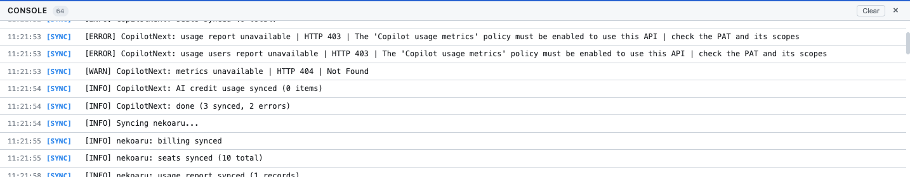

每条日志包含时间、来源标签和级别。`[ERROR]` 行会直接给出受影响的组织、HTTP 状态码和原因，通常足以定位缺少的权限或未开启的策略。

| 现象 | 检查 |
|------|------|
| 红色 "Data sync is failing" 提醒 | 提醒中指出的 PAT：过期或被撤销时在 Settings 中更换令牌；HTTP 403 时检查 SSO 授权 |
| seats 为空 | PAT、企业 slug、组织与企业端点权限、同步日志 |
| AI Usage 空白 | 详细 CSV 是否到达、日期范围、用户名匹配 |
| 四项计量未提供 | 原 CSV 是否缺列、空白或无效 |
| 企业团队为空 | Classic PAT、`read:enterprise`、团队同步 |
| 预算未变化 | GitHub 写回状态、目标实体、错误与重试 |
| SSO 授权后回到登录 | 域名、回调、代理协议头、共享会话存储 |
| AI 一直未就绪 | CLI 安装、独立认证、账号订阅与模型权限 |
| 本月图表滞后 | CSV 最新日期，实时预算不代表报表已更新 |
| owner 看不到中心 | 登录名、授权、中心状态、普通用户登录策略 |

日常建议依次检查同步、未分配用户、模型与团队成本、待审请求，再处理闲置席位建议。执行真实写入前保留业务确认，不上传或转发 PAT、OAuth Secret、Cookie。

<a id="owner"></a>
## 第二章：Cost Center Owner

### 2.1 权限与角色切换

owner 由管理员从中心成员中授权，不因加入中心自动获得，也不是企业管理员。

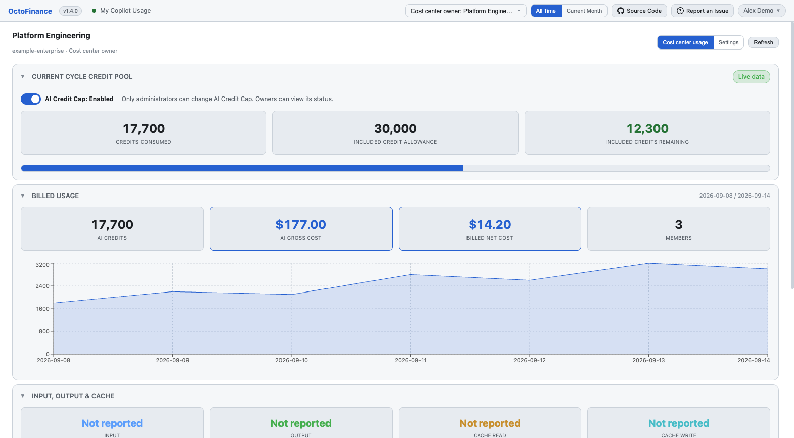

图中顶部角色下拉框是个人视图与负责人视图的切换入口。示例中的 Not reported 表示额外计量尚未提供，不表示额度池消耗为零。

1. 使用被授权的 GitHub 账号登录。
2. 顶部角色选择器默认是个人视图，并列出负责的中心。
3. 选择具体中心，同时核对企业标识，避免同名中心混淆。
4. 看个人用量或提交个人申请时切回个人视图。

角色会定期以及在窗口获得焦点时刷新，刚授权时可刷新页面。撤销后后端会拒绝读取或写入，不依赖旧页面继续操作。

### 2.2 当前额度与历史用量

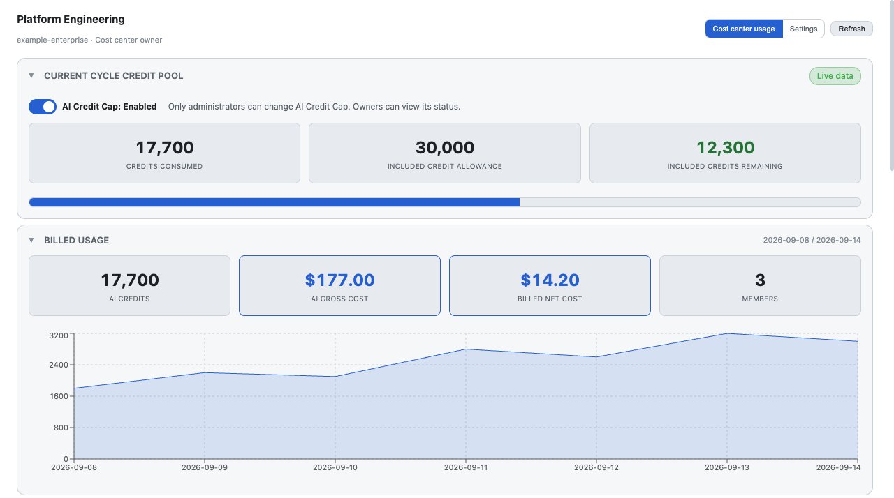

| 信息 | 解读 |
|------|------|
| AI Credit Cap | 状态只读，只有管理员可修改 |
| Consumed / Included allowance / Remaining | 当前账期额度池的已用、包含额度和余额 |
| Live / Cached / Unavailable | 数据来源和可用性，未知不按零处理 |
| AI credits / AI cost | 选定期间已获取 CSV 的消耗和金额 |
| Billed cost | 详细账单净额，可能与 AI cost gross 口径不同 |
| Members | 当前成员数，不保证每人都有报表记录 |

历史用量切换不会把当前额度池变成历史快照。即使选 All Time，额度池仍用于判断当前周期约束。截图使用示例数据。

### 2.3 模型、成员与输入输出缓存

按以下顺序分析：确认中心和期间，检查 CSV 覆盖日期，定位每日消耗突增，再看模型与成员明细。模型和成员图表可切换 credits 或金额，较多项目时图表展示排名靠前部分，表格用于完整明细。

Input, Output & Cache 显示四项总量和趋势；模型、成员表提供明细。缺失显示 Not reported，零显示 0，旧报表缺列不代表没有使用。缓存量不直接等于节省金额。

只可读取授权中心范围。出现账单范围不明确提示时，部分记录无法可靠归属，应请管理员核对，不把当前结果当作完整账单。

### 2.4 成员个人预算

| 条件 | 行为 |
|------|------|
| Cap 实时验证开启，预算可读取，成员与预算匹配明确 | 可设置或编辑 |
| Cap 关闭 | 只读，避免无中心额度约束时扩大支出 |
| Cap 未知或实时验证失败 | 只读，恢复验证后再操作 |
| 预算不可用或多个候选预算 | 只读，请管理员排查 |
| 成员已离开或 owner 授权撤销 | 拒绝修改 |

1. 进入中心 **Settings**。
2. 核对成员现有预算、已用、余额和 hard limit。
3. 选择 **Set budget** 或 **Edit budget**。
4. 输入月度美元金额并选择 hard limit。
5. 核对用户和中心，点击 **Confirm and save**。
6. 检查执行反馈及刷新后的数值。

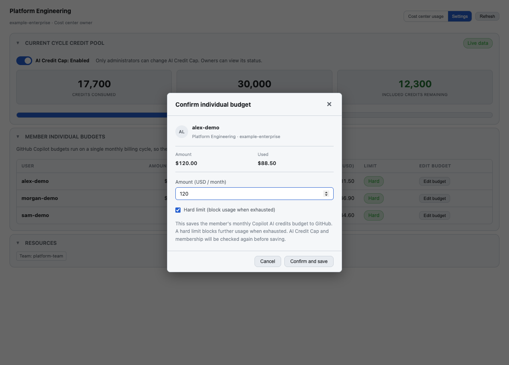

截图停留在保存前。保存会真实创建或更新 GitHub individual budget，并再次校验授权、成员和 Cap。弹窗打开时可编辑，不保证稍后保存仍可执行。

这不是为中心增加共享额度，个人也不保证能使用到所填金额，其他额度与策略仍可能先限制。金额需满足表单校验，不使用负数或零代替禁用。

### 2.5 权限边界与常见问题

owner 不能配置 PAT/SSO、全局同步或导入 CSV，不能使用管理员 AI 工具、审批全局请求、授权其他 owner、修改 Cap 或管理未授权中心。分享链接与 owner 授权也相互独立。

| 问题 | 处理 |
|------|------|
| 没有角色下拉框 | 核对管理员授权与登录账号 |
| 只显示部分中心 | 仅列出授权中心，不是全部成员归属 |
| 看得到成员但不能改预算 | 看 Cap、验证和预算状态，以及预算匹配是否唯一 |
| 成员没有四项计量 | 检查报表字段与期间，不直接判定未使用 |
| 保存权限错误 | 刷新授权、成员、Cap，并联系管理员 |

需要增加中心额度、变更资源归属或解决同步失败时联系管理员。自己的预算或归属申请从个人视图提交，见第三章。

<a id="user"></a>
## 第三章：普通用户

### 3.1 登录与门户

选择 **Sign in with GitHub**，使用自己的账号登录。非管理员进入个人门户，主要是 **My Usage** 与申请入口；顶部提供 All Time / Current Month，用户菜单提供语言、主题和退出。

个人数据按 GitHub 登录名匹配管理员已收集数据。用户不需要添加 PAT；账号变更、尚未同步或报表缺少自己时，请管理员核对。加入中心不自动获得查看同事数据的权限。

### 3.2 My Usage 的各个区域

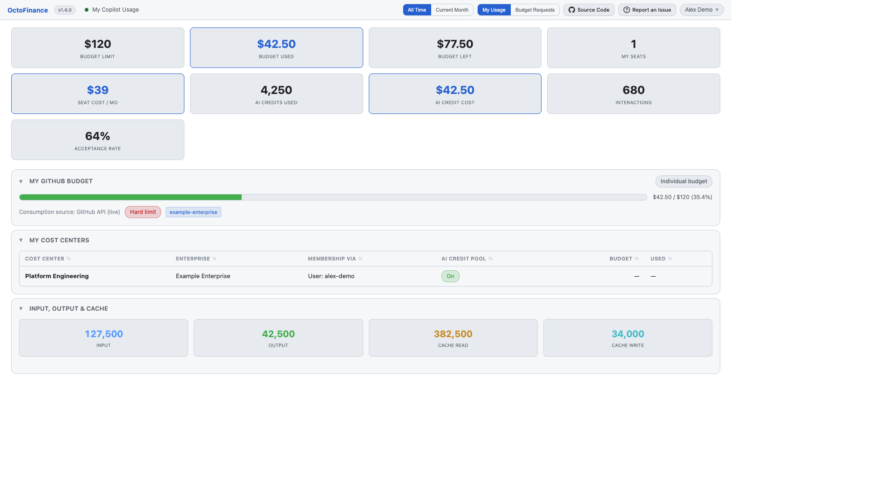

示例只展示当前有数据的部分区域；顶部 My Usage 与 Budget Requests 分别进入个人用量和申请。

| 区域 | 内容 |
|------|------|
| KPI | 预算、已用与余额、席位与估算月费、credits、费用、交互与接受率 |
| My GitHub Budget | 生效的 individual 或 universal 预算，注明消耗来源 |
| My Cost Centers | 所属中心、直接或继承来源、Cap 与相关摘要 |
| AI Credit Quota | 报表计划额度及比例 |
| My Copilot Seats | 计划、团队、分配时间、最近活动 |
| Activity / Feature | 每日交互、接受活动、功能分布 |
| AI Credit Usage / Models | 自己的每日 credits、成本和模型 |
| Input, Output & Cache | 四项总量、趋势及模型明细 |
| Billed Usage | 按 SKU 的个人账单明细 |

有些区域仅在有数据时显示。空白并不证明未授权 Copilot，可能是当前期间没有记录或管理员尚未获取数据。接受率和代码行数是用量观察指标，不是单独的工作绩效判断。

### 3.3 预算、配额与归属

预算是支出控制，不是已付款或充值。看本月余额时选择 Current Month，在可用时刷新，并检查消耗来自 GitHub 还是用量估计。切换月份不会补齐 CSV。

个人预算和通用规则不能直接相加为可用总额；页面说明实际适用来源。计划包含的 credits、报表 quota、美元预算和成本中心 Cap 也不同，一个进度条未满不保证不受其他限制。

直接用户归属可以申请变更；继承自组织或团队的中心归属不能在个人表单绕过，需要管理员调整上层资源。看到中心摘要不代表能读取其他成员用量。

### 3.4 输入、输出与缓存

四项指标只汇总自己的报表记录，模型表可按支持的列排序。Not reported 表示没有有效值，0 表示真实零。较早导出缺列时，管理员获取新版完整详细 CSV 后刷新即可，不需要个人重新配置。

不要把输出量当作完成任务数，也不要把 cache read 直接当作费用优惠。判断额度需求时同时查看 credits、金额和剩余预算。

### 3.5 申请个人预算

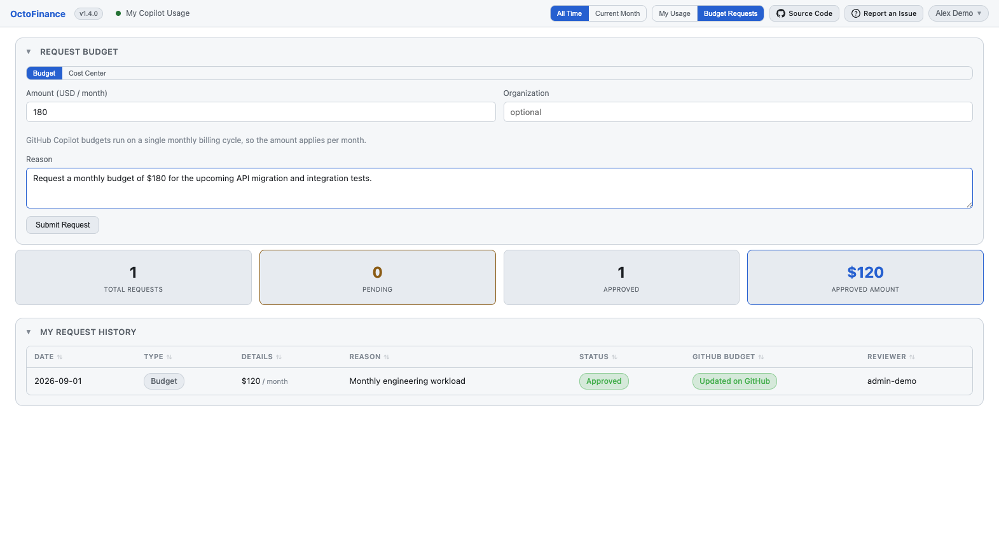

截图中的新申请尚未提交，下方历史记录为示例。

1. 打开申请入口，选择 **Budget** 类型。
2. 输入期望的个人月度预算，按需填写组织。
3. 写明任务、当前额度不足的原因与预计使用需求。
4. 核对后提交，在 **My Request History** 跟踪。

金额是希望设置的预算总额，不是自动追加额。例如从 50 调到 100，应明确目标为 100，而非假设填写 50 会被系统相加。预算使用月度账期，表单不选择任意起止日。

提交只创建申请，管理员可批准不同金额、拒绝或尚未完成写回。不要反复提交相同请求代替查询进度。

### 3.6 申请变更成本中心

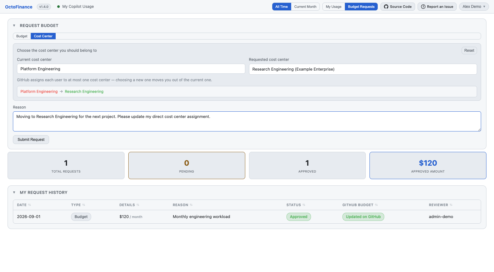

1. 选择 **Cost Center** 申请类型。
2. 核对当前中心与成员来源。
3. 选择目标中心，或 **Unassigned** 申请离开当前直接归属。
4. 阅读从原中心到目标中心的预览，填写原因后提交。
5. 等待审批，查看 GitHub 执行结果。

直接用户分配通常会迁出原中心，不是新增第二份直接归属。Inherited 表示继承关系，不能直接按单个用户修改。中心变更影响费用归属与额度约束，但不会自动授予 owner，也不会自动提高个人预算。

### 3.7 跟踪与确认生效

| 状态 | 含义 |
|------|------|
| Pending | 等待审批，可按页面操作撤回 |
| Approved | 本地已批准，继续检查 GitHub 状态 |
| Rejected | 阅读意见，必要时补充理由重新申请 |
| Failed / Not synced | 未确认 GitHub 生效，请管理员排查或重试 |
| Created / Updated / Applied | GitHub 返回成功，刷新预算或归属核对 |

个人历史只展示自己的请求。Approved 不等于已生效，批准通知也不是账单凭证。后续管理员调整金额时，应看最新记录和数据来源。

### 3.8 常见问题

| 现象 | 处理 |
|------|------|
| 无法登录 | 管理员可能限制普通用户 SSO，确认策略 |
| 看不到全局 dashboard 或 AI 对话 | 正常角色限制 |
| 无角色下拉框 | 尚无 owner 授权，成员身份不等于 owner |
| 有 Copilot 但用量为空 | 核对同步、CSV 覆盖和登录名 |
| 本月只有部分天数据 | 等待管理员获取新报表 |
| 预算未满却受限 | 检查 Cap、包含额度、hard limit 与 GitHub 策略 |
| 批准后额度未变 | 核对 GitHub 写回结果，联系管理员刷新或重试 |

报障提供登录名、时间、所选期间、申请记录与错误提示即可，不发送 PAT、OAuth Secret、Cookie 或未经处理的完整账单。

更多参考：[英文完整指南](USER_GUIDE_EN.md)、[功能与 API](FEATURES.md)、[架构](ARCHITECTURE.md)、[安全说明](SECURITY.md)。